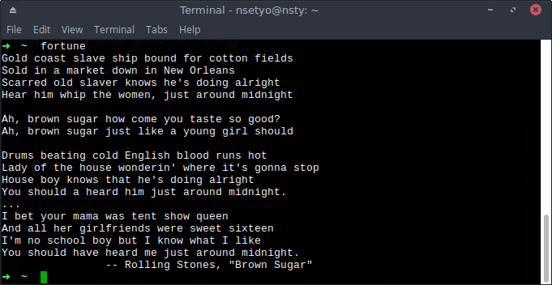
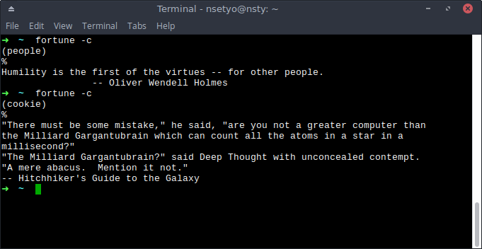
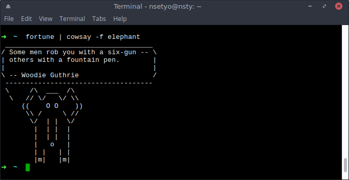

Fortune Cookies, atau kue keberuntungan adalah sebuah kue yang tipis dan renyah,
yang berisi sepotong kertas dengan kata-kata yang berisi petuah atau
ramalan[^1]. Seperti halnya _fortune cookies_, di GNU/Linux terdapat aplikasi
dengan fungsi serupa, mengeluarkan kata-kata mulai dari petuah, lawakan, sampai
kutipan dari film-film terkenal secara acak. Di GNU/Linux fungsi ini bisa
didapat dengan memasang aplikasi `fortune`. Aplikasi `fortune` dapat dipasang
dengan perintah:

#### Arch Linux

```
# sudo pacman -S fortune-mod
```

#### Ubuntu

```
# apt-get install fortune-mod
```

<!--more-->

Selanjutnya untuk menjalankan fortune dapat menggunakan perintah:

```
$ fortune
```



Seperti terlihat pada gambar di atas, setiap kali dijalankan, `fortune` akan
memberikan kata-kata secara acak, layaknya _fortune cookies_. Kata-kata atau
kutipan yang dikeluarkan `fortune` diambil dari berkas fortune. Di Arch Linux
berkas fortune berada pada `/usr/share/fortune/` dan `/usr/share/fortune/off/`
untuk kata-kata atau kutipan yang dianggap _offensive_.

Secara _default_ `fortune` akan menampilkan secara acak dari semua kategori.
Untuk melihat kategori dari kutipan yang ditampilkan bisa menambahkan `-c`.

```
$ fortune -c
```



Untuk menampilkan hanya kategori yang dipilih dapat menggunakan perintah
`fortune berkas_fortune` [^2], berkas _fortune_ yang dimaksud merupakan berkas
yang ada pada direktori `/usr/share/fortune` atau `/usr/share/fortune/off`.
Berikut merupakan contoh untuk menampilkan _fortune_ hanya untuk kategori wisdom
dan humorist.


### Cowsay

Cowsay digunakan untuk menampilkan fortune dengan seni ascii. Untuk
menggunakannya terlebih dahulu kita harus memasang cowsay dengan cara:

#### Arch Linux

```
$ sudo pacman -S cowsay
```

#### Ubuntu

```
$ sudo apt-get install cowsay
```

Lalu jalankan cowsay dan fortune:

```
$ fortune | cowsay
```

Atau

```
$ fortune | cowthink
```


Selain sapi, cowsay juga memiliki seni ascii lainnya yang dapat dilihat dengan
perintah `cowsay -l`, dan `cowsay -f cow` [^3] untuk menampilkan dengan gambar
lain. Berikut contoh menampilkan cowsay dengan ascii gajah:



### Menjalankan secara otomatis

Untuk menampilkan `fortune`/`fortune`+`cowsay` secara otomatis setiap kali kita
menjalankan terminal, tambahkan baris perintah berikut pada berkas `~/.bashrc`
untuk bash, dan `~/.zshrc` untuk zsh:

```shell
if [ -x /usr/bin/cowsay -a -x /usr/bin/fortune ]; then
    fortune custom | cowsay
fi
```

### Membuat daftar kutipan sendiri

Daftar kutipan `fortune` sebenarnya hanya berkas teks biasa, sehingga untuk
membuatnya hanya butuh _text editor_.

#### 1. Buat berkas fortune dengan _Text editor_

Buat kutipan pada sebuah berkas text dengan satu baris berisi karakter `%`
sebagai pembatas antar kutipan. Contoh:

```
"Compliment three people every day."
-Life's Little Instruction Book
%
"Have a firm handshake."
-Life's Little Instruction Book
%
"Look people in the eye."
-Life's Little Instruction Book
%
```

Setelah selesai, simpan berkas tanpa ekstensi.

#### 2. Buat berkas `*.dat`

Buat berkas `*.dat` dengan menjalankan perintah:

```
$ strfile -c % namaberkas namaberkas.dat
```

#### 3. Jalankan fortune

Jalankan `fortune` dengan berkas yang baru saja dibuat.

```
$ fortune /path/to/namaberkas
```

atau dapat juga dengan menyalin kedua berkas yang telah dibuat ke folder
`/usr/share/fortune` dan dapat langsung menjalankan fortune dengan:

```
$ fortune namaberkas
```


Sekian.

[^1]: <https://id.wikipedia.org/wiki/Kue_keberuntungan>
[^2]: <http://linux.die.net/man/6/fortune>
[^3]: <http://linux.die.net/man/1/cowsay>
