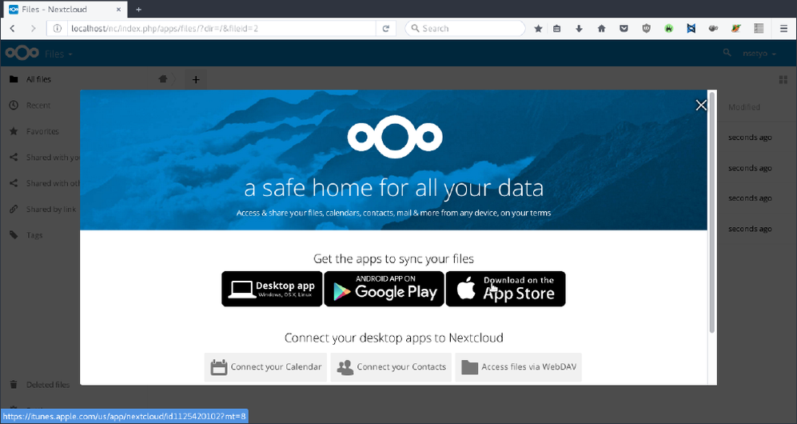

#### System Requirements

Untuk menjalankan Nextcloud Server direkomendasikan untuk memenuhi persyaratan
berikut:

-   512MB RAM
-   Linux Server (Direkomendasikan Debian 7, SUSE Linux Enterprise Server 11 SP3
    & 12, Red Hat Enterprise Linux/CentOS 6.5 and 7, Ubuntu 14.04 LTS, 16.04
    LTS)
-   Web server: [Apache 2 (mod_php, php-fpm)][1] or [Nginx (php-fpm)][2]
-   PHP >= 5.6
-   Databases: MySQL/MariaDB 5.5+; PostgreSQL; Oracle 11g

<!--more-->

#### Database Requirements untuk MySQL / MariaDB

Untuk menjalankan Nextcloud server dengan MySQL/MariaDB, dibutuhkan pengaturan
tambahan sebagai berikut:

-   Menonaktifkan _Binary Logging_ atau mengatur format log menjadi "mixed"
    (BINLOG_FORMAT = MIXED).
-   InnoDB storage engine
-   “READ COMMITED” transaction isolation level.

#### Emoji (UTF8 4-byte) support with MySQL / MariaDB

Untuk dapat mengaktifkan penggunaan emoji pada Nextcloud, database yang dibuat
harus menggunakan _charset_ `utf8mb4` dan _collate_ `utf8mb4_general_ci`,
contoh:

```
CREATE DATABASE nextcloud CHARACTER SET utf8mb4 COLLATE utf8mb4_general_ci;
```

#### Prasyarat PHP

Berikut merupakan modul yang wajib ada untuk dapat menjalankan Nextcloud:

-   PHP (>= 5.6, 7.0 or 7.1)
-   PHP module ctype
-   PHP module dom
-   PHP module GD
-   PHP module iconv
-   PHP module JSON
-   PHP module libxml (Linux package libxml2 must be >=2.7.0)
-   PHP module mb multibyte
-   PHP module posix
-   PHP module SimpleXML
-   PHP module XMLWriter
-   PHP module zip
-   PHP module zlib

Untuk koneksi database

-   PHP module sqlite
-   PHP module pdo_mysql (MySQL/MariaDB)
-   PHP module pgsql (requires PostgreSQL >= 9.0)

#### Mempersiapkan Server

Unduh berkas arsip Nextcloud di <https://nextcloud.com/install>. Lalu Ekstrak
berkas Nextcloud ke root folder webserver.

```
$ tar xjvf nextcloud-11.0.2.tar.bz2
```

Atau jika menggunakan berkas .zip

```
$ unzip nextcloud-11.0.2.zip
```

Ubah kepemilikan berkas

```
# chown www-data:www-data -R nextcloud
```

Aktifkan `mod_rewrite`, `mod_headers`, `mod_env`, `mod_dir`, dan `mod_mime`.

```
# a2enmod rewrite
# a2enmod headers
# a2enmod env
# a2enmod dir
# a2enmod mime
```

Restart Server

```
# systemctl restart apache2.service
```

Atau

```
# systemctl restart nginx.service
```

#### Mempersiapkan Database

Masuk ke database server, pada kali ini saya menggunakan MariaDB. Lalu buat
database baru

```
CREATE DATABASE nextcloud CHARACTER SET utf8mb4 COLLATE utf8mb4_general_ci;
```

Buat user baru khusus untuk Nextcloud (opsional)

```
CREATE USER 'nextcloud'@'localhost' IDENTIFIED BY 'password';
GRANT ALL PRIVILEGES ON nextcloud.* TO 'nextcloud'@'localhost' IDENTIFIED BY 'password';
```

#### Instal Nextcloud

Akses Nextcloud melalui <http://localhost/nextcloud>. Pada bagian database pilih
MySQL/MariaDB lalu isi sesuai data yang sudah dibuat sebelumnya. Jika selesai
maka Nextcloud siap digunakan. Rujuk
[dokumentasi Nextcloud](https://docs.nextcloud.com) untuk informasi lebih
lanjut.


