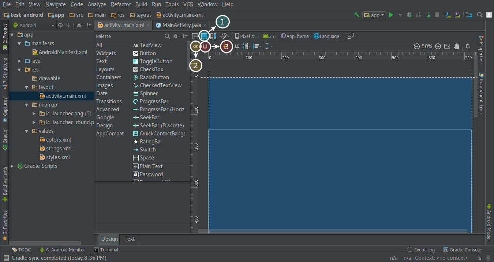
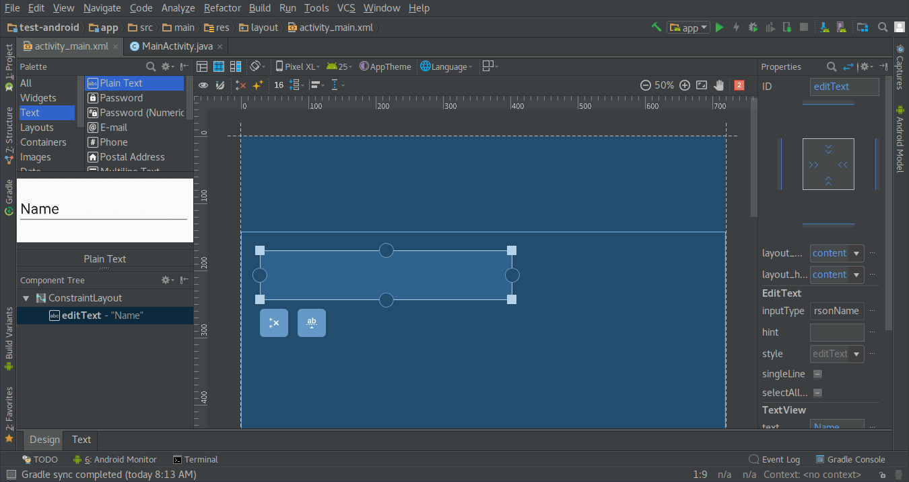
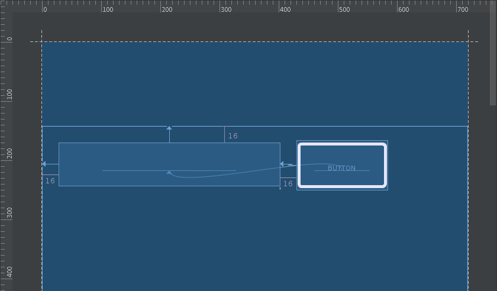

Pada tulisan ini saya akan membuat antarmuka sederhana untuk aplikasi Android.
Antarmuka ini nantinya akan berisi sebuah _textbox_ dan sebuah tombol di sisi
kanannya.

Antarmuka aplikasi android dibentuk dari _layout_ (ViewGroup Object) dan
_widget_ (View Object) yang tersusun secara hirarkis. Layout merupakan kontainer
tak terlihat yang mengendalikan bagaimana objek turunannya diposisikan pada
layar. Widget merupakan komponen antarmuka seperti textbox dan tombol.

<!--more-->

### 1. Persiapan:

1. Buat [project baru][1].
2. Buka berkas `app > res > layout > activity_main.xml` yang ada pada project.
3. Klik tab design pada bagian bawah window.
4. Aktifkan Blueprint (1).
5. Aktifkan Show Constraint (2).
6. Matikan Autoconnect (3).
7. Ubah default margin menjadi 16.
8. Hapus TextView Hello World.



### 2. Menambahkan Textbox

#### 2.1 Menggunakan Design Editor

1. Dari jendela palette di bagian kiri, pilih panel **Text**, lalu klik dan
   tarik **Plain Text** ke design editor. **Plain Text** ini merupakan EditText
   Widget yang berfungsi untuk menerima input dari user.
2. Klik _view_ (Plain Text Widget) sampai terlihat _resizing handle_, berbentuk
   persegi, pada setiap sudut dan _constraint anchor_, berbentuk lingkaran, pada
   setiap sisinya. Seperti terlihat pada Gambar 2.
3. Buat _Constraint_ dengan cara klik dan tarik _constraint anchor_ pada sisi
   atas sampai bertemu dengan sisi atas layout seperti pada Gambar 3. Constraint
   ini berfungsi untuk memastikan bahwa _view object_ berada sejauh 16dp dari
   bagian atas layout, sesuai dengan margin yang sudah ditentukan.
4. Ulangin langkah 3 untuk membuat Constraint ke bagian kiri layout.
5. Hasil akhir terlihat seperti Gambar 3.




#### 2.2 Menggunakan XML Editor

Tambahkan syntax berikut pada `app > res > layout > activity_main.xml`

```xml
<EditText
    android:id="@+id/editText"
    android:layout_width="wrap_content"
    android:layout_height="wrap_content"
    android:ems="10"
    android:inputType="textPersonName"
    android:text="Name"
    app:layout_constraintTop_toTopOf="parent"
    android:layout_marginTop="16dp"
    android:layout_marginLeft="16dp"
    app:layout_constraintLeft_toLeftOf="parent" />

```

Sehingga `activity_main.xml` menjadi

```xml
<?xml version="1.0" encoding="utf-8"?>
<android.support.constraint.ConstraintLayout
    xmlns:android="http://schemas.android.com/apk/res/android"
    xmlns:app="http://schemas.android.com/apk/res-auto"
    xmlns:tools="http://schemas.android.com/tools"
    android:layout_width="match_parent"
    android:layout_height="match_parent"
    tools:context="id.nsetyo.myapplication.MainActivity">

    <EditText
        android:id="@+id/editText"
        android:layout_width="wrap_content"
        android:layout_height="wrap_content"
        android:ems="10"
        android:inputType="textPersonName"
        android:text="Name"
        app:layout_constraintTop_toTopOf="parent"
        android:layout_marginTop="16dp"
        android:layout_marginLeft="16dp"
        app:layout_constraintLeft_toLeftOf="parent" />

</android.support.constraint.ConstraintLayout>
```

### 3. Menambahkan Tombol

#### 3.1 Menggunakan Design Editor

1. Dari jendela palette di bagian kiri, pilih panel **Widgets**, lalu klik dan
   tarik **Button** ke design editor.
2. Buat Constraint dari sisi kiri Tombol ke sisi kanan Textbox.
3. Untuk membuat tombol dan textbox sejajar horizontal, buat Baseline Constraint
   dengan cara klik tombol  lalu
   tarik menuju _baseline anchor_ yang ada pada Textbox.
4. Hasilnya akan seperti Gambar 4.



#### 3.2 Menggunakan XML Editor

Tambahkan syntax berikut pada `app > res > layout > activity_main.xml`

```xml
<Button
        android:id="@+id/button"
        android:layout_width="wrap_content"
        android:layout_height="wrap_content"
        android:text="Button"
        app:layout_constraintBaseline_toBaselineOf="@+id/editText"
        app:layout_constraintLeft_toRightOf="@+id/editText"
        android:layout_marginLeft="16dp" />
```

Sehingga `activity_main.xml` menjadi:

```xml
<?xml version="1.0" encoding="utf-8"?>
<android.support.constraint.ConstraintLayout
    xmlns:android="http://schemas.android.com/apk/res/android"
    xmlns:app="http://schemas.android.com/apk/res-auto"
    xmlns:tools="http://schemas.android.com/tools"
    android:layout_width="match_parent"
    android:layout_height="match_parent"
    tools:context="id.nsetyo.myapplication.MainActivity">

    <EditText
        android:id="@+id/editText"
        android:layout_width="wrap_content"
        android:layout_height="wrap_content"
        android:ems="10"
        android:inputType="textPersonName"
        android:text="Name"
        app:layout_constraintTop_toTopOf="parent"
        android:layout_marginTop="16dp"
        android:layout_marginLeft="16dp"
        app:layout_constraintLeft_toLeftOf="parent" />

    <Button
        android:id="@+id/button"
        android:layout_width="wrap_content"
        android:layout_height="wrap_content"
        android:text="Button"
        app:layout_constraintBaseline_toBaselineOf="@+id/editText"
        app:layout_constraintLeft_toRightOf="@+id/editText"
        android:layout_marginLeft="16dp" />
</android.support.constraint.ConstraintLayout>

```

### 4. Membuat Textbox fleksibel

Saat ini lebar dari textbox hanya 10ems, sehingga terdapat ruang kosong pada
bagian kanan layar, sebelah kanan tombol, seperti terlihat pada Gambar 4
sebelumnya. Dengan ukuran Textbox yang fleksibel, lebar Textbox akan mengikuti
ukuran layar sehingga dapat mengisi ruang kosong yang tersedia. Berikut
tahapannya:

1. Buat Constraint dari sisi kanan tombol ke sisi kanan layout menggunakan cara
   seperti sebelumnya, bisa juga dengan menambahkan
   `app:layout_constraintRight_toRightOf="parent"` di bagian tombol pada
   `activity_main.xml`.
2. Tambahkan Constraint dari sisi kanan Textbox ke sisi kiri tombol dengan
   menambahkan `app:layout_constraintRight_toLeftOf="@+id/button"` di bagian
   Textbox pada `activity_main.xml`.
3. Klik Textbox, pada **Properties Window** klik indikator lebar object (`>>`)
   atau (`<<`) seperti pada Gambar 5. Ubah Menjadi Match Constraint seperti pada
   Gambar 6.


Hasil akhir pada `activity_main.xml` adalah sebagai berikut:

```xml
<?xml version="1.0" encoding="utf-8"?>
<android.support.constraint.ConstraintLayout
    xmlns:android="http://schemas.android.com/apk/res/android"
    xmlns:app="http://schemas.android.com/apk/res-auto"
    xmlns:tools="http://schemas.android.com/tools"
    android:layout_width="match_parent"
    android:layout_height="match_parent"
    tools:context="id.nsetyo.myapplication.MainActivity">

    <EditText
        android:id="@+id/editText"
        android:layout_width="0dp"
        android:layout_height="wrap_content"
        android:layout_marginLeft="16dp"
        android:layout_marginRight="0dp"
        android:layout_marginTop="16dp"
        android:ems="10"
        android:hint="@string/textbox_placeholder"

        android:inputType="textPersonName"
        app:layout_constraintLeft_toLeftOf="parent"
        app:layout_constraintRight_toLeftOf="@+id/button"
        app:layout_constraintTop_toTopOf="parent" />

    <Button
        android:id="@+id/button"
        android:layout_width="wrap_content"
        android:layout_height="wrap_content"
        android:text="Button"
        app:layout_constraintBaseline_toBaselineOf="@+id/editText"
        app:layout_constraintLeft_toRightOf="@+id/editText"
        android:layout_marginLeft="16dp"
        android:layout_marginRight="16dp"
        app:layout_constraintRight_toRightOf="parent" />

</android.support.constraint.ConstraintLayout>
```

Selesai, antarmuka yang dihasilkan seperti pada Gambar 7. dan Gambar 8.


Lebih lanjut [https://developer.android.com/training/...][2]

[1]:
    https://developer.android.com/training/basics/firstapp/creating-project.html
[2]: https://developer.android.com/training/basics/firstapp/building-ui.html
